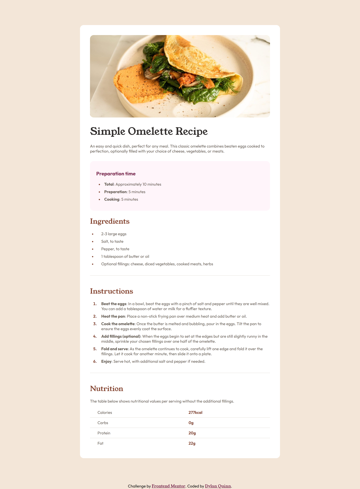
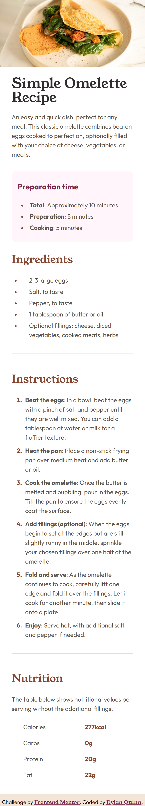

# Frontend Mentor - Recipe page solution

## Table of contents

- [Overview](#overview)
  - [Screenshot](#screenshot)
  - [Links](#links)
- [My process](#my-process)
  - [Built with](#built-with)
  - [What I learned](#what-i-learned)
  - [Continued development](#continued-development)
  - [Useful resources](#useful-resources)
- [Author](#author)
- [Acknowledgments](#acknowledgments)

## Overview

This is my submission for the fourth Frontend Mentor project, built with vanilla HTML and CSS. This one definitely humbled me with having to learn many more additional methods compared to the last 3 projects. This one differed far more from the others, requiring me to implement lists and a table, learning how to format and design those elements.

### Screenshots

    <b>Desktop</b>
    <b>Mobile</b>

### Links

[Repository](https://github.com/dquinn089/frontend-mentor-recipe-page/)
[Live Link](https://dquinn089.github.io/frontend-mentor-recipe-page/)

## My process

As always I started with my HTML structure, referencing the example creating an outline made up of seperate `
` elements containing `<ul>` and `<li>` elements for seperated comprensive lists. Then I started designing with CSS, setting global styles for each of the shared elements, then working from top to bottom on each div elements design details. I then used CSS media queries to make the necessary responsive display adjustments. Made final adjustments for some of the spacing and cleaned up the CSS.

### Built with

- Semantic HTML5 markup
- CSS custom properties
- Flex

### What I learned

Definitely learned more on the styling for padding, margins, spacing, and so on having to work with much more content, in which the user actually has to scroll down the webpage. Also got to learn more on styling `<ul>` `<li>` elements as well as building and styling a `<table>` element for the first time.

### Continued development

While I generally prefer to deepen my expertise in a select few programs rather than spread myself too thin, I am eager to start working with libraries more in the future. I'm seeking web design tips that will enable me to minimize time spent on styling so I can focus more on functionality.

### Useful resources

- https://www.freecodecamp.org/learn/
- https://stackoverflow.com/

## Author

- https://github.com/dquinn089
- https://www.frontendmentor.io/profile/dquinn089

## Acknowledgments

- Thank you to [FrontendMentor](https://www.frontendmentor.io/home), having a community working on the same learning paths has been a wonderful resource and a huge help.
- Of Course thank you to [ChatGPT](https://chatgpt.com/), always coming in handy.